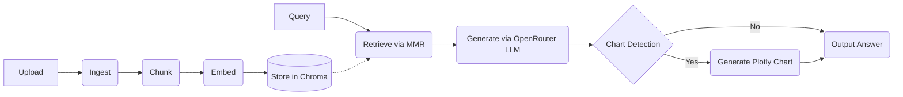

# Legal Multi-Modal RAG — Document & Tabular Q&A with Auto-Charting

A powerful, multimodal Retrieval-Augmented Generation (RAG) system tailored for legal and analytical use cases. The pipeline ingests documents (PDFs with OCR support) and tabular data (CSV, Excel, SQL), embedding them locally using HuggingFace models, and leverages an LLM (Gemini via OpenRouter) to provide precise, cited answers. It also routes analytical queries to an intelligent chart builder, generating Plotly visualisations automatically.

## Features
- Multi-modal ingestion: PDF (text + scanned/OCR) and tabular (CSV, Excel, SQL)
- Cited answers grounded strictly in uploaded documents
- Intelligent chart routing — auto-generates Plotly charts for analytical queries
- MMR retrieval for diverse, relevant context
- RAGAS evaluation suite (Faithfulness, Answer Relevancy, Context Recall)
- Zero-cost embeddings via local HuggingFace model

## Architecture Diagram


## Tech Stack
| Layer | Technology |
|---|---|
| Frontend | Streamlit |
| Orchestration | LangChain (LCEL) |
| OCR & PDF parsing | PyMuPDF, Tesseract |
| Tabular parsing | Pandas, SQLparse |
| Embeddings | HuggingFace (`all-MiniLM-L6-v2`) |
| Vector Store | Chroma DB |
| LLM | OpenRouter API (Gemini 1.5 Flash) |
| Charting | Plotly |
| Evaluation | RAGAS |

## Project Structure
```
legal-multimodal-rag/
├── app.py                     
├── pipeline/
│   ├── ingest.py              
│   ├── tabular_ingest.py      
│   ├── chunker.py             
│   ├── embedder.py            
│   ├── retriever.py           
│   ├── generator.py           
│   ├── chart_detector.py      
│   ├── chart_generator.py     
│   └── evaluator.py           
├── requirements.txt
├── .gitignore
└── README.md
```

## Setup & Installation
```bash
git clone https://github.com/AnshSingh30/legal-multimodal-rag.git
cd legal-multimodal-rag
python -m venv venv
source venv/bin/activate        # Windows: venv\Scripts\activate
pip install -r requirements.txt
```

**Note on Tesseract OS dependency:**
- Ubuntu: `sudo apt install tesseract-ocr poppler-utils`
- Mac: `brew install tesseract poppler`
- Windows: Download and install the UB-Mannheim Tesseract installer.

## Environment Variables
Create a `.env` file at the root:
```
OPENROUTER_API_KEY="your-openrouter-key"
```
Get a free key at https://openrouter.ai

## Usage
```bash
streamlit run app.py
```
Then upload documents → click Index Documents → chat.

## Evaluation
```bash
python pipeline/evaluator.py
```
Provides RAGAS metrics including Faithfulness, Answer Relevancy, and Context Recall.

---
Author: Ansh Singh | [GitHub](https://github.com/AnshSingh30)
