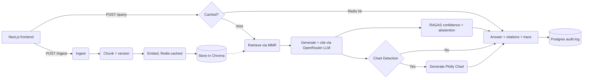

# Legal Multi-Modal RAG — Document & Tabular Q&A with Auto-Charting

A powerful, multimodal Retrieval-Augmented Generation (RAG) system tailored for legal and analytical use cases. The pipeline ingests documents (PDFs with OCR support) and tabular data (CSV, Excel, SQL), embedding them locally using HuggingFace models, and leverages an LLM (Gemini via OpenRouter) to provide precise, cited answers. It also routes analytical queries to an intelligent chart builder, generating Plotly visualisations automatically.

## Features
- Multi-modal ingestion: PDF (text + scanned/OCR) and tabular (CSV, Excel, SQL)
- Cited answers grounded strictly in uploaded documents, with page number + bounding
  box tracked per chunk (native PDF text via PyMuPDF word boxes, OCR'd pages via
  Tesseract word boxes) so a claim can be traced back to an exact region on the page
- Live per-answer faithfulness scoring (RAGAS) with abstention below a 0.85 threshold —
  the API never returns an answer it can't ground in a real citation
- Redis-backed caching for repeated `/query` calls and chunk/query embeddings, failing
  open (uncached) if Redis is unreachable rather than breaking ingestion or querying
- Postgres audit log of every query (including abstentions and cache hits), with an
  admin-key-gated `GET /audit/recent`
- Document versioning: re-ingesting a file under the same name creates a new version
  rather than overwriting it in place, with a chunk-level diff between any two versions
- Interactive Next.js frontend: split-pane PDF viewer with citation bbox highlighting,
  retrieval trace panel, session query history, and a version picker + diff view
- Intelligent chart routing — auto-generates Plotly charts for analytical queries
- MMR retrieval for diverse, relevant context, optionally scoped to a single ingested
  document and/or a specific version of it
- FastAPI service (`api/`) alongside the original Streamlit demo (`app.py`), both built
  on the same `rag/` pipeline
- RAGAS evaluation suite (Faithfulness, Answer Relevancy, Context Recall)
- Zero-cost embeddings via local HuggingFace model

## Architecture Diagram

```mermaid
flowchart LR
    UI[Next.js frontend] -->|POST /ingest| B(Ingest)
    B --> C(Chunk + version)
    C --> D(Embed, Redis-cached)
    D --> E[(Store in Chroma)]
    UI -->|POST /query| Q{Cached?}
    Q -->|Redis hit| ANS
    Q -->|miss| G(Retrieve via MMR)
    G --> H(Generate + cite via OpenRouter LLM)
    E -.-> G
    H --> CONF(RAGAS confidence + abstention)
    CONF --> ANS[Answer + citations + trace]
    ANS --> AUDIT[(Postgres audit log)]
    H --> I{Chart Detection}
    I -->|Yes| J(Generate Plotly Chart)
    I -->|No| ANS
    J --> ANS
```

## Tech Stack
| Layer | Technology |
|---|---|
| Frontend (interactive) | Next.js 16, TypeScript, Tailwind v4, react-pdf, Zustand |
| Frontend (demo) | Streamlit |
| Backend API | FastAPI (async, `run_in_threadpool` around the sync OCR/embedding/LLM calls) |
| Cache | Redis (query responses, chunk/query embeddings) |
| Audit log | Postgres via SQLAlchemy async + asyncpg |
| Orchestration | LangChain (LCEL) |
| OCR & PDF parsing | PyMuPDF, Tesseract |
| Tabular parsing | Pandas, SQLparse |
| Embeddings | HuggingFace (`all-MiniLM-L6-v2`) |
| Vector Store | Chroma DB |
| LLM | OpenRouter API (Gemini 1.5 Flash) |
| Charting | Plotly |
| Evaluation / live confidence | RAGAS (Faithfulness, Answer Relevancy, Context Recall) |

## Project Structure
```
legal-multimodal-rag/
├── app.py                   # Streamlit demo UI
├── rag/                     # Core pipeline, shared by app.py and api/
│   ├── ingestion.py
│   ├── tabular_ingest.py
│   ├── chunking.py
│   ├── embedding.py
│   ├── retrieval.py         # MMR retriever + score_retrieved_docs (trace/audit)
│   ├── generation.py        # citation-checked answer generation
│   ├── confidence.py         # live RAGAS faithfulness scoring + abstention
│   ├── cache.py              # Redis-backed query + embedding cache
│   ├── versioning.py         # doc_id/version scheme, chunk-level diff
│   ├── chart_detector.py
│   ├── chart_generator.py
│   └── evaluator.py         # offline RAGAS eval harness
├── api/                     # FastAPI service
│   ├── main.py               # /ingest, /query, /documents/*, /audit/recent, /health
│   ├── audit.py               # Postgres audit_log table + writes/reads
│   ├── schemas.py
│   └── state.py
├── frontend/                # Next.js app: upload, Q&A, PDF citation viewer,
│   │                        # retrieval trace, query history, version diff
│   └── src/
│       ├── app/page.tsx
│       ├── components/
│       ├── lib/               # typed API client, mirrors api/schemas.py
│       └── store/             # Zustand session query history
├── tests/                   # pytest suite for api/ and rag/
├── .streamlit/
│   └── config.toml
├── Dockerfile
├── docker-compose.yml        # containerized Streamlit app deploy
├── docker-compose.dev.yml    # local Redis + Postgres for the FastAPI backend
├── .dockerignore
├── .env.example
├── requirements.txt
├── .gitignore
└── README.md
```

## 🚀 Live Demo

[**Live app on Streamlit Community Cloud**](https://legal-multimodal-rag.streamlit.app)

---

## Setup & Installation

### Option A — Run with Docker (recommended)

#### Prerequisites
- Docker + Docker Compose installed
- A free OpenRouter API key from https://openrouter.ai

#### Quick Start
```bash
git clone https://github.com/AnshSingh30/legal-multimodal-rag.git
cd legal-multimodal-rag

# Copy and fill in your API key
cp .env.example .env
# Edit .env and add your OPENROUTER_API_KEY

# Build and run
docker compose up --build
```

Open http://localhost:8501

#### Data Persistence
- **Vector index:** stored in Docker volume `chroma_data`
- **Uploaded files:** stored in Docker volume `upload_data`
- **To reset:** `docker compose down -v`

---

### Option B — Run locally (without Docker)

```bash
git clone https://github.com/AnshSingh30/legal-multimodal-rag.git
cd legal-multimodal-rag
python -m venv venv
source venv/bin/activate        # Windows: venv\Scripts\activate
pip install -r requirements.txt
```

**Note on Tesseract OS dependency:**
- Ubuntu: `sudo apt install tesseract-ocr poppler-utils`
- Mac: `brew install tesseract poppler`
- Windows: Download and install the UB-Mannheim Tesseract installer.

## Environment Variables
Create a `.env` file at the root:
```
OPENROUTER_API_KEY="your-openrouter-key"
```
Get a free key at https://openrouter.ai

## Usage
```bash
streamlit run app.py
```
Then upload documents → click Index Documents → chat.

---

## Backend API (FastAPI)

An async FastAPI service lives alongside the Streamlit demo, built on the same
`rag/` pipeline and the same persisted Chroma store at `./chroma_db`.

### Local infra (Redis + Postgres)
```bash
docker compose -f docker-compose.dev.yml up -d
```
Starts Redis (query/embedding cache) and Postgres (audit log) with the exact
defaults `rag/cache.py` / `api/audit.py` already assume — no `.env` changes needed
to use them as-is. Both are optional in the sense that the API degrades gracefully
without Redis (cache misses every time) but the audit log requires Postgres to be
reachable for writes to succeed (failures are caught and logged, not fatal to `/query`).

### Run locally
```bash
uvicorn api.main:app --reload
```

### Endpoints
| Method & Path | Description |
|---|---|
| `GET /health` | Basic health check |
| `POST /ingest` | Multipart file upload (`pdf`, `csv`, `xlsx`, `xls`, `sql`, `docx`). Returns `{doc_id, filename, chunks_indexed, document_version}`. Re-ingesting a file by the same name creates a new version rather than replacing it. |
| `POST /query` | `{"question": str, "doc_id": str \| null, "document_version": int \| null}` — `doc_id` scopes retrieval to one document; omitting `document_version` resolves to that document's latest version. |
| `GET /documents/{doc_id}/versions` | Lists every version ingested under this `doc_id` (version number, chunk count, content hash, ingested date). |
| `GET /documents/{doc_id}/diff?from=&to=` | Chunk-level diff between two versions — added/removed/changed, with a unified text diff for changed chunks. Position/row-based alignment, not semantic diffing. |
| `GET /documents/{doc_id}/file` | Serves the ingested file's current bytes (for the frontend's PDF viewer). Reflects whatever's currently on disk for that filename — only chunk metadata is versioned, not the physical file. |
| `GET /audit/recent?limit=` | Recent audit log entries. Requires an `X-Admin-Key` header matching `ADMIN_KEY`; 503 if `ADMIN_KEY` isn't configured, 403 on a wrong/missing key. |

### `/query` response shape
```json
{
  "answer": "string — or an explicit refusal/abstention message",
  "confidence": "high | medium | low",
  "source_documents": [{"source": "...", "page": 1, "chunk_text": "..."}],
  "citations": [{"doc_id": "...", "page_number": 1, "bbox": [x0, y0, x1, y1], "chunk_text": "...", "method": "text | ocr | null"}],
  "retrieval_trace": [{"chunk_id": "...", "source": "...", "page": 1, "score": 1.12, "retrieval_method": "dense (MMR)"}],
  "chart": {"...": "plotly figure JSON, or null"},
  "chart_type": "bar | line | pie | scatter | table | none | null",
  "chart_reason": "string | null"
}
```

- `citations` contains only the chunks the model actually cited and validated
  against the retrieved context — not every retrieved chunk (see `source_documents`
  for that). It's empty whenever the answer abstained.
- `confidence` comes from a live RAGAS faithfulness score computed per-request. Below
  0.85 the `answer` is replaced with an explicit abstention message, but `confidence`
  still reports the real `"medium"`/`"low"` bucket rather than collapsing every
  abstention to one label.
- `bbox` is `[x0, y0, x1, y1]` — PDF point space for native text, pixel space at the
  300dpi OCR render for scanned pages (`method: "ocr"`). `null` where no line-level
  match was found (e.g. tabular data, which has no page/bbox concept).
- `retrieval_trace`'s `score` is a raw similarity **distance** (lower = more similar),
  not a normalized 0-1 relevance score — Chroma's built-in normalization was observed
  returning out-of-range values for this collection's distance metric, so this uses
  the raw value instead. `retrieval_method` is reported honestly as `"dense (MMR)"`:
  this codebase only implements single-path dense retrieval, not the hybrid
  dense+sparse setup an earlier draft of this project assumed.
- Responses are cached in Redis for `QUERY_CACHE_TTL_SECONDS` (default 1h), keyed on
  `(doc_id, resolved document_version, question)` — check the `X-Cache: HIT|MISS`
  response header.

### Tests
```bash
pytest
```
Requires Redis and Postgres reachable (see [Local infra](#local-infra-redis--postgres)
above) and a valid `OPENROUTER_API_KEY` — a handful of tests call the real LLM.

---

## Frontend (Next.js)

An interactive frontend in `frontend/` (Next.js 16, TypeScript, Tailwind v4) talks to
the FastAPI service above — it's a separate app, not served by the Streamlit demo.

### Run locally
```bash
cd frontend
npm install
cp .env.local.example .env.local   # NEXT_PUBLIC_API_URL, defaults to http://localhost:8000
npm run dev
```
Open the printed URL (`http://localhost:3000`, or the next free port if that one's
taken by something else on your machine).

### What's there
- **Upload**: drag-and-drop or click-to-browse, calls `POST /ingest`, shows an
  explicit "OCR in progress" message for scanned PDFs.
- **PDF citation viewer**: split-pane layout, renders the ingested PDF (`react-pdf`)
  on the left. When an answer arrives, auto-scrolls to the first cited page and
  highlights every citation's `bbox`, across as many pages as it spans. Non-PDF
  documents show a placeholder instead (there's no page/bbox concept for them).
- **Ask panel**: question input, confidence badge, citation list.
- **Retrieval trace**: collapsible table of every retrieved chunk from `retrieval_trace`
  (chunk id, page, distance, retrieval method).
- **Query history**: past questions/answers this session (Zustand, persisted to
  `sessionStorage` — survives navigation within the tab, not closing it), click one
  to redisplay it.
- **Version picker + diff**: appears once a document has more than one version; pick
  which version `/query` targets, or view a chunk-level diff between any two.

### Requires
The backend running with CORS configured for the frontend's origin — the default
`CORS_ALLOWED_ORIGINS` already covers `http://localhost:3000` through `3009`.

---

## ☁️ Deploy to Streamlit Community Cloud

1. Push this repo to GitHub
2. Go to [share.streamlit.io](https://share.streamlit.io) and sign in with GitHub
3. Click **New app** → select `AnshSingh30/legal-multimodal-rag` → branch `main` → main file `app.py`
4. Click **Advanced settings** → **Secrets** → paste:
   ```
   OPENROUTER_API_KEY = "sk-or-v1-your-real-key"
   OPENROUTER_MODEL = "google/gemini-1.5-flash"
   ```
5. Click **Deploy!** — your app will be live at `https://your-app-name.streamlit.app`

> **Note:** ChromaDB storage is ephemeral on Streamlit Cloud — each visitor gets a clean slate (re-index per session). This is by design for a portfolio showcase.

## 🐳 Alternative Deploy: Render (Docker)

1. Go to [render.com](https://render.com) → **New** → **Web Service**
2. Connect your GitHub repo
3. Settings: Environment = **Docker**, Dockerfile path = `./Dockerfile`
4. Add environment variables: `OPENROUTER_API_KEY`, `OPENROUTER_MODEL`
5. (Optional) Add a 1 GB disk mounted at `/app/chroma_db` for persistence
6. Click **Create Web Service**

> **Note:** Render free tier spins down after 15 min of inactivity. First request takes ~30–60s to wake.

---

## Evaluation
```bash
python -m rag.evaluator
```
Provides RAGAS metrics including Faithfulness, Answer Relevancy, and Context Recall.
This is the offline batch harness; `/query` in the FastAPI service also scores
Faithfulness live, per request (see [Backend API](#backend-api-fastapi)).

---
Author: Ansh Singh | [GitHub](https://github.com/AnshSingh30)
