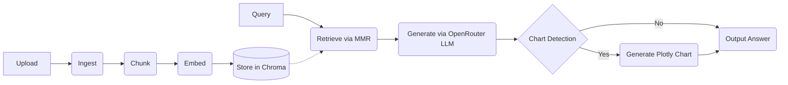

# Legal Multi-Modal RAG — Document & Tabular Q&A with Auto-Charting

A powerful, multimodal Retrieval-Augmented Generation (RAG) system tailored for legal and analytical use cases. The pipeline ingests documents (PDFs with OCR support) and tabular data (CSV, Excel, SQL), embedding them locally using HuggingFace models, and leverages an LLM (Gemini via OpenRouter) to provide precise, cited answers. It also routes analytical queries to an intelligent chart builder, generating Plotly visualisations automatically.

## Features
- Multi-modal ingestion: PDF (text + scanned/OCR) and tabular (CSV, Excel, SQL)
- Cited answers grounded strictly in uploaded documents, with page number + bounding
  box tracked per chunk (native PDF text via PyMuPDF word boxes, OCR'd pages via
  Tesseract word boxes) so a claim can be traced back to an exact region on the page
- Live per-answer faithfulness scoring (RAGAS) with abstention below a 0.85 threshold —
  the API never returns an answer it can't ground in a real citation
- Intelligent chart routing — auto-generates Plotly charts for analytical queries
- MMR retrieval for diverse, relevant context, optionally scoped to a single ingested document
- FastAPI service (`api/`) alongside the original Streamlit demo (`app.py`), both built
  on the same `rag/` pipeline
- RAGAS evaluation suite (Faithfulness, Answer Relevancy, Context Recall)
- Zero-cost embeddings via local HuggingFace model

## Architecture Diagram

```mermaid
flowchart LR
    A[Upload] --> B(Ingest)
    B --> C(Chunk)
    C --> D(Embed)
    D --> E[(Store in Chroma)]
    F[Query] --> G(Retrieve via MMR)
    G --> H(Generate via OpenRouter LLM)
    E -.-> G
    H --> I{Chart Detection}
    I -->|Yes| J(Generate Plotly Chart)
    I -->|No| K(Output Answer)
    J --> K
```

## Tech Stack
| Layer | Technology |
|---|---|
| Frontend (demo) | Streamlit |
| Backend API | FastAPI (async, `run_in_threadpool` around the sync OCR/embedding/LLM calls) |
| Orchestration | LangChain (LCEL) |
| OCR & PDF parsing | PyMuPDF, Tesseract |
| Tabular parsing | Pandas, SQLparse |
| Embeddings | HuggingFace (`all-MiniLM-L6-v2`) |
| Vector Store | Chroma DB |
| LLM | OpenRouter API (Gemini 1.5 Flash) |
| Charting | Plotly |
| Evaluation / live confidence | RAGAS (Faithfulness, Answer Relevancy, Context Recall) |

## Project Structure
```
legal-multimodal-rag/
├── app.py                   # Streamlit demo UI
├── rag/                     # Core pipeline, shared by app.py and api/
│   ├── ingestion.py
│   ├── tabular_ingest.py
│   ├── chunking.py
│   ├── embedding.py
│   ├── retrieval.py
│   ├── generation.py        # citation-checked answer generation
│   ├── confidence.py         # live RAGAS faithfulness scoring + abstention
│   ├── chart_detector.py
│   ├── chart_generator.py
│   └── evaluator.py         # offline RAGAS eval harness
├── api/                     # FastAPI service
│   ├── main.py               # POST /ingest, POST /query, GET /health
│   ├── schemas.py
│   └── state.py
├── tests/                   # pytest suite for api/ and rag/
├── .streamlit/
│   └── config.toml
├── Dockerfile
├── docker-compose.yml
├── .dockerignore
├── .env.example
├── requirements.txt
├── .gitignore
└── README.md
```

## 🚀 Live Demo

[**Live app on Streamlit Community Cloud**](https://legal-multimodal-rag.streamlit.app)

---

## Setup & Installation

### Option A — Run with Docker (recommended)

#### Prerequisites
- Docker + Docker Compose installed
- A free OpenRouter API key from https://openrouter.ai

#### Quick Start
```bash
git clone https://github.com/AnshSingh30/legal-multimodal-rag.git
cd legal-multimodal-rag

# Copy and fill in your API key
cp .env.example .env
# Edit .env and add your OPENROUTER_API_KEY

# Build and run
docker compose up --build
```

Open http://localhost:8501

#### Data Persistence
- **Vector index:** stored in Docker volume `chroma_data`
- **Uploaded files:** stored in Docker volume `upload_data`
- **To reset:** `docker compose down -v`

---

### Option B — Run locally (without Docker)

```bash
git clone https://github.com/AnshSingh30/legal-multimodal-rag.git
cd legal-multimodal-rag
python -m venv venv
source venv/bin/activate        # Windows: venv\Scripts\activate
pip install -r requirements.txt
```

**Note on Tesseract OS dependency:**
- Ubuntu: `sudo apt install tesseract-ocr poppler-utils`
- Mac: `brew install tesseract poppler`
- Windows: Download and install the UB-Mannheim Tesseract installer.

## Environment Variables
Create a `.env` file at the root:
```
OPENROUTER_API_KEY="your-openrouter-key"
```
Get a free key at https://openrouter.ai

## Usage
```bash
streamlit run app.py
```
Then upload documents → click Index Documents → chat.

---

## Backend API (FastAPI)

An async FastAPI service lives alongside the Streamlit demo, built on the same
`rag/` pipeline and the same persisted Chroma store at `./chroma_db`.

### Run locally
```bash
uvicorn api.main:app --reload
```

### Endpoints
| Method & Path | Description |
|---|---|
| `GET /health` | Basic health check |
| `POST /ingest` | Multipart file upload (`pdf`, `csv`, `xlsx`, `xls`, `sql`, `docx`). Returns `{doc_id, filename, chunks_indexed}`. |
| `POST /query` | `{"question": str, "doc_id": str \| null}` — `doc_id` optionally scopes retrieval to one ingested document. |

### `/query` response shape
```json
{
  "answer": "string — or an explicit refusal/abstention message",
  "confidence": "high | medium | low",
  "source_documents": [{"source": "...", "page": 1, "chunk_text": "..."}],
  "citations": [{"doc_id": "...", "page_number": 1, "bbox": [x0, y0, x1, y1], "chunk_text": "..."}],
  "chart": {"...": "plotly figure JSON, or null"},
  "chart_type": "bar | line | pie | scatter | table | none | null",
  "chart_reason": "string | null"
}
```

- `citations` contains only the chunks the model actually cited and validated
  against the retrieved context — not every retrieved chunk (see `source_documents`
  for that). It's empty whenever the answer abstained.
- `confidence` comes from a live RAGAS faithfulness score computed per-request. Below
  0.85 the `answer` is replaced with an explicit abstention message, but `confidence`
  still reports the real `"medium"`/`"low"` bucket rather than collapsing every
  abstention to one label.
- `bbox` is `[x0, y0, x1, y1]` — PDF point space for native text, pixel space at the
  300dpi OCR render for scanned pages. `null` where no line-level match was found
  (e.g. tabular data, which has no page/bbox concept).

### Tests
```bash
pytest
```
A few tests that require a real LLM call are marked `xfail` if `OPENROUTER_API_KEY`
is invalid — check your key if you see those turn from `xfail` to a hard failure
(that would mean something else broke) or start passing outright (harmless; means
the key started working — remove the `xfail` marker).

---

## ☁️ Deploy to Streamlit Community Cloud

1. Push this repo to GitHub
2. Go to [share.streamlit.io](https://share.streamlit.io) and sign in with GitHub
3. Click **New app** → select `AnshSingh30/legal-multimodal-rag` → branch `main` → main file `app.py`
4. Click **Advanced settings** → **Secrets** → paste:
   ```
   OPENROUTER_API_KEY = "sk-or-v1-your-real-key"
   OPENROUTER_MODEL = "google/gemini-1.5-flash"
   ```
5. Click **Deploy!** — your app will be live at `https://your-app-name.streamlit.app`

> **Note:** ChromaDB storage is ephemeral on Streamlit Cloud — each visitor gets a clean slate (re-index per session). This is by design for a portfolio showcase.

## 🐳 Alternative Deploy: Render (Docker)

1. Go to [render.com](https://render.com) → **New** → **Web Service**
2. Connect your GitHub repo
3. Settings: Environment = **Docker**, Dockerfile path = `./Dockerfile`
4. Add environment variables: `OPENROUTER_API_KEY`, `OPENROUTER_MODEL`
5. (Optional) Add a 1 GB disk mounted at `/app/chroma_db` for persistence
6. Click **Create Web Service**

> **Note:** Render free tier spins down after 15 min of inactivity. First request takes ~30–60s to wake.

---

## Evaluation
```bash
python -m rag.evaluator
```
Provides RAGAS metrics including Faithfulness, Answer Relevancy, and Context Recall.
This is the offline batch harness; `/query` in the FastAPI service also scores
Faithfulness live, per request (see [Backend API](#backend-api-fastapi)).

---
Author: Ansh Singh | [GitHub](https://github.com/AnshSingh30)
